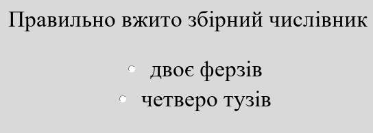
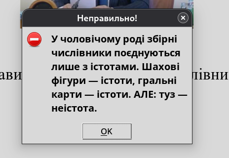

# Симулятор Азарова: Підвал Авраменка
## Геймплей
Симулятор Азарова: Підвал Авраменка — це жартівлива гра, у якій ви граєте за колишнього прем'єр-міністра Миколу Азарова. Він відомий своїм ламаним суржиком, що в народі прозвали азірівкою. Головним лиходієм виступає Олександр Авраменко, який викрав Азарова й змусив його писати тест з української мови.
## Особливості геймплею
**1) Досить складний тест із 20 запитань.**

**2) Завдання беруться випадково з великого списку questionList.py. Зараз налічується 361 завдання.**

**3) 6 кінцівок. Кінцівка залежить від кількості правильних відповідей у тесті.**

**4) КОНЧЕНА СКЛАДНІСТЬ**



## Як встановити?
Гра написана на Python з бібліотекою Tkinter.

### 1. Скачати готову програму
https://drive.proton.me/urls/983ZWXMY0M#UQG8nXLSlCls
### 2. Якщо у вас є Python
Клонуйте репозиторій за допомогою Git, або завантажте zip-версію репозиторію й розпакуйте її. У терміналі (Windows або Linux) перейдіть до папки з кодом та запустіть main.py:
```
python3 main.py
``` 
Якщо ваш Python називається по-іншому:
```
python main.py
```
## Зверніть увагу
Не перейменовуйте папки та файли, не переміщайте зображення з папки pictures, інакше програма їх не знайде. 
